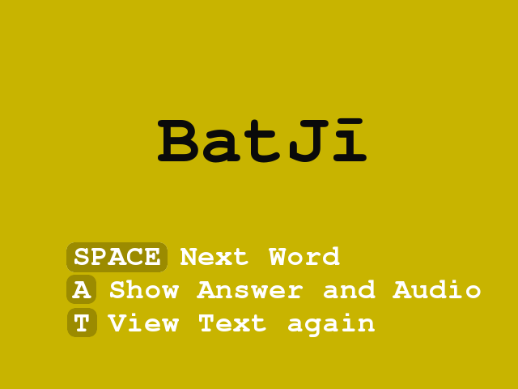
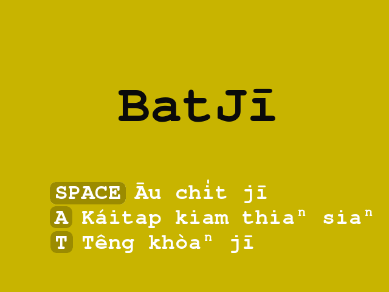
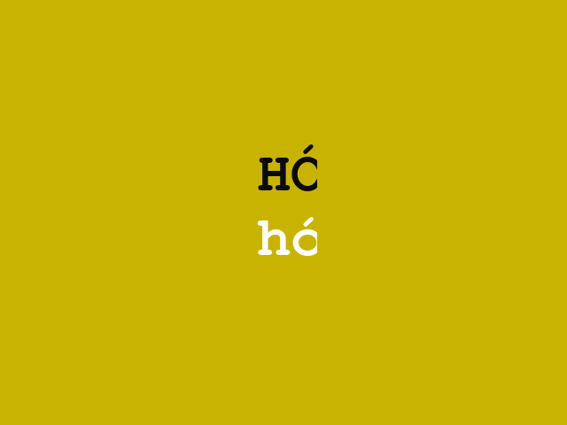
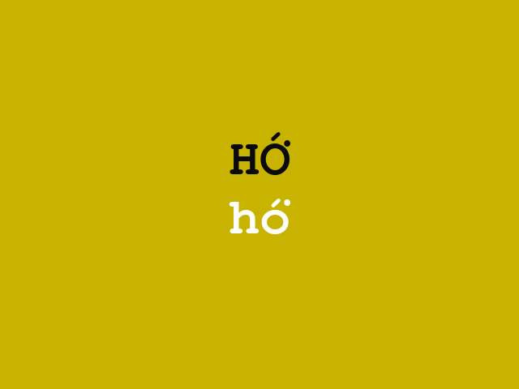

# About

I started this toy project for my son, who have learnt speaking/listening English from YouTube (no kidding).
English is not our family language (we speak Tâigí aka Taiwanese),
but he managed to learn it when he watching fun videos on YouTube.
Although he do speak and understand simple English sentences (i.e. `It's the coolest car in the whole world.'),
he still don't recognise most of the words.

In an unsleeping night, I got an idea to write a simple learning tool for my son.
Then I started to compose a protype in Python which can show text from the filename of saved photos.
At the beginning I download corresponding audio files from Google Translate manually,
and quickly I realized that it's not a solution.
So I googled and found the [gTTS](https://pypi.org/project/gTTS/) module which provides a feasible way to generate audio from text.

I asked him to play with the prototype and he loves it!

Several days later I started to think about adding Tâigí into the project,
because it's my family language and it's facing critical situation in Taiwan
(FYI: Most people in Taiwan don't speak Taiwanese anymore. The main language is Mandarin Chinese nowadays.).
Also, I'm always hoping to contribute to Tâigí (Taiwanese) as much as I can,
and do something by programming seems a good choice.

Adding Tâigí text cards was not difficult,
but I have no idea on getting Tâigí audio files from online sources.
It's the main future work of this project.
If you have any solution for it, please contact me.

# Usage

* Clone the project.
* Extract `photos.tar.bz2` and `audio_clips.tar.bz2`.
* The command could be

    `python3 batji.py` which will show English cards, or

    `python3 batji.py -t` to show Tâigí (Taiwanese) cards instead.

## How to add new cards

* Find suitable photos of new words.
* Save the photos in the directory `photos/` and name them in the form of `new_word.ext`.
* For Tâigí users: Tī `pio.csv` lāité, ke-thiⁿ `new_word` kái sêng `new word, sīn jī`.

## Some notes

* The audio files have to be generated via [gTTS](https://pypi.org/project/gTTS/) which needs to work with internet connection.
* The `audio_clips.tar.bz2` contains no audio files. It only provides a set of directories in which the auto-generated audio files will be saved to.
* The program uses [mpg123](https://mpg123.org/) to play the audio tracks.
* The `pio.csv` file contains corresponding translation from English to Tâigí. You don't need it if you're using only English text cards.
* All the photos used in the project are downloaded from sources which provided [Creative Commons](https://creativecommons.org/) images.

## Known issues

The program using PIL modules to show the Unicode characters of Tâigí.
For unknown reason, the words will be cropped when they end with letter `o͘'.
The following screenshots show the cropped word and the desired one:

* The word `hó͘' is cropped:

    

* The desired result by a workaround (which has been implemented in the code):

    

---
# TODO

* To add audio module for Tâigí (Taiwanese) pronounciation.

---
Possible useful tips to resize big photos to smaller ones:

* Use the following command to scale large images into width of 640px:

    `mogrify -scale 640 -density 72 -quality 80 -path ./ -format jpg input.files`
