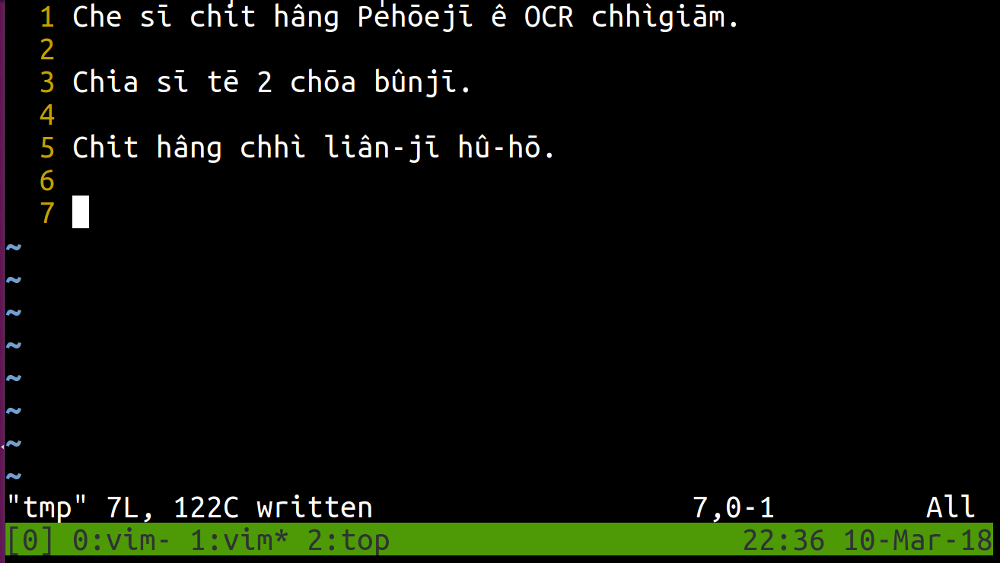
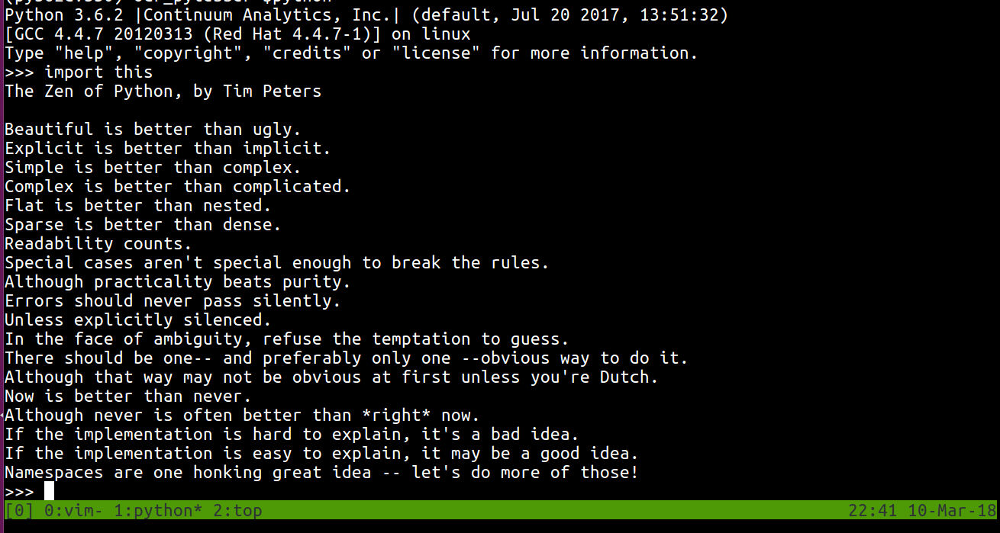
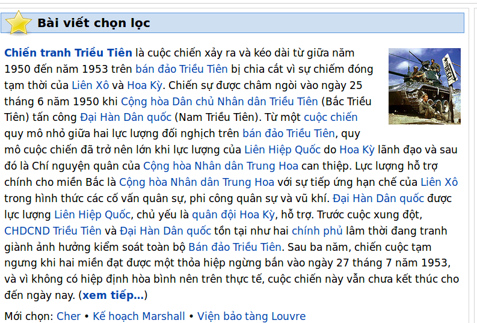
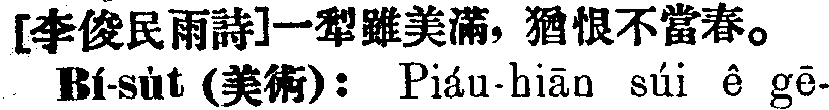

__NOTE: This is an incomplete project.__

[2018-03-10]

* Tried to use [pytesseract](https://github.com/madmaze/pytesseract) to extract text from images.
* In Ubuntu, install `tesseract-ocr` before using `pytesseract`.
* Installed `tesseract-ocr-vie` to extract Vietnamese text.
* Installed `tesseract-ocr-chi-tra` to extract Traditional Chinese text.
* Inūi bô Tâigí chit ê gígiân ê chuliāu, só͘í bô hoattō͘ ti̍tchiap chhúlí Pe̍hōejī.
  * Iōng Enggí kap Oa̍tlâmgí lâi chhúlí Pe̍hōejī, kiatkó lóng chiâⁿ bái.

# Test results

## Tâigí chhìgiām


* iōng Enggí:
```text
1 Che si chit héng Péhéeji é OCR chhigiém.
g Chia si té Z ch6a bfinji.

: Chit héng chhi lién-ji hfi-hé.

3|


22:36 10-Mar-18
```

* iōng Oa̍tlâmgí:

```
1 Che sỉ chít hàng Pẻhõejỉ ê OCR chhìgíảm.
ẳ Chìa sỉ tẻ 2 chõa bũnjỉ.

Ế Chít hàng chhì líân-jỉ hũ-hõ.

Ễl


22:36 10-Mar-18
```

## English text



```text
Python 3.6.2 |Continuum Analytics, Inc.| (default, Jul 20 2017, 13:51:32)
[GCC 4.4.7 20120313 (Red Hat 4.4.7-1)] on linux

Type "help", "copyright", "credits" or "license" for more information.
>>> import this

The Zen of Python, by Tim Peters


Beautiful is better than ugly.

Explicit is better than implicit.

Simple is better than complex.

Complex is better than complicated.

Flat is better than nested.

Sparse is better than dense.

Readability counts.

Special cases aren't special enough to break the rules.

Although practicality beats purity.

Errors should never pass silently.

Unless explicitly silenced.

In the face of ambiguity, refuse the temptation to guess.

There should be one-- and preferably only one --obvious way to do it.
Although that way may not be obvious at first unless you're Dutch.
Now is better than never.

Although never is often better than *right* now.

If the implementation is hard to explain, it's a bad idea.

If the implementation is easy to explain, it may be a good idea.
Namespaces are one honking great idea -- let's do more of those!
```

## Vietnamese text



```
Ý Bài viết chọn lọc


Chiến tranh Triều Tiên là cuộc chiến xảy ra và kéo dài từ giữa năm
1950 đến năm 1953 trên bán đảo Triều Tiên bị chia cắt vì sự chiếm đóng
tạm thời của Liên Xô và Hoa Kỳ. Chiến sự được chấm ng ào ngày 25
tháng 6 năm 1950 khi Cộng hòa Dân chủ Nhân dân Triều Tiên (Bắc Triều
Tiên) tấn côn Đại Hàn Dân quốc (Nam Triều Tiên). Từ một cuộc chiến
quy mô nhỏ g ưa hai lực lượng đối nghịch trên bán đảo Triều Tiền,qu
mỏ cuộc chiến đã trở nên lớn khi lực lượng của Liên HiệlJ Quốc do Hoa Kỳ lãnh đạo và sau
đó là Chí nguyện quân của Cộng hòa Nhân dân Trung Hoa can thiệp. Lực lượng hỗ trợ
chính cho miền Bắc là Cộng hòa Nhân dân Trung Hoa với sựtiẽp ứng hạn chế của Liên Xô
trong hình thức các cố vấn quân sự, phi công quân sự và vũ khí. Đại Hàn Dân quốc được
lực lượng Liên HiệlJ Quốc, chủ yếu là quân đội Hoa Kỳ, hỗ trợ. Trước cuộc xung đột,
CHDCND Triều Tiên và Đại Hàn Dân quốc tồn tại như hai chính phủ lâm thời đang tranh
giành ảnh hướng kiểm soát toàn bộ Bán đảo Triều Tiên. sau ba năm, chiến cuộc tạm
ngưng khi hai miền đạt được một thỏa hiệp ngừng bắn vào ngày 27 tháng 7 năm 1953,
và vì không có hiệp định hòa hình nên trên thực tế, cuộc chiến này vẫn chưa kết thúc cho
đến ngày nay. (xem tiếp…)


Mới chọn: Cher ~ Kế hoạch Marshall ~ Viện bảo tàng Louvre
```

## 漢字 (using Traditional Chinese)



```text
[李俊民雨詩﹞一犁雖美滿， 猶恨不當春。
ˊ 囍童˙s贛蒿(芙術)︰ Pi諗u‧hi磊【﹞ slii 芭 g邑‧
```

---
# TODO
* [TrainingTesseract](https://github.com/tesseract-ocr/tesseract/wiki/TrainingTesseract)
  * Checked the version of Tesseract by `tesseract --version` in Ubuntu 16.04.
  * The version is `3.04.01`.

* [miendinh/VietnameseOCR](https://github.com/miendinh/VietnameseOCR)
